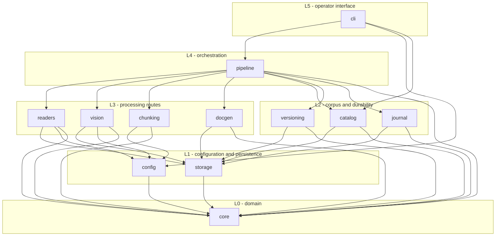

# Package Design — Financial Agentic application

Package and module dependencies for the Silver-layer pipeline (SPEC-01 Phase 1).

`ARCHITECTURE.md` imposes three rules that this design satisfies:

1. Each folder under the application package is a module.
2. Dependencies are acyclic.
3. A higher layer may depend on a lower layer; **modules in the same layer may not depend on each other**.

## Layer map

| Layer | Modules | May depend on |
|---|---|---|
| L0 | `core` | nothing |
| L1 | `config`, `storage` | L0 |
| L2 | `catalog`, `versioning`, `journal` | L0, L1 |
| L3 | `readers`, `vision`, `chunking`, `docgen` | L0, L1, L2 |
| L4 | `pipeline` | L0–L3 |
| L5 | `cli` | L0–L4 |

## Dependency graph

## Why the same-layer rule shapes the design

The prohibition on same-layer dependencies is not bureaucratic here; it forces two decisions that
keep the pipeline testable:

- **`docgen` cannot call `readers`.** Both are L3. So a reader cannot write its own format
  document — it must *return* a descriptive value object that `pipeline` hands to `docgen`. That
  keeps readers pure enough to unit-test without a filesystem, and it guarantees every route
  produces a format document through one code path rather than each reader remembering to.
- **Routing lives in L4, not L3.** Choosing between the tabular, text and vision routes requires
  knowing all three exist, and no L3 module is permitted that knowledge. `pipeline/routing.py` is
  therefore the single place where the SPEC-01 req 6 decision table lives.

Likewise `versioning` cannot call `journal`, so a reuse decision cannot read the run journal
directly; it takes a prior outcome passed down from L4. That is what makes
`versioning.reuse.decide` a pure function and lets the whole SPEC-01 req 8 policy be tested
without writing a single file.

## Module responsibilities

| Module | Responsibility |
|---|---|
| `core` | Frozen domain values and the closed status/error/route vocabulary. No I/O. |
| `config` | Loading, validating and fingerprinting settings. Separate from runtime logic. |
| `storage` | Crash-safe publication: atomic replace, create-exclusive, append-only journals. |
| `catalog` | Walking the corpus, resolving scopes, hashing content, scope-isolated deduplication. |
| `versioning` | Version allocation, sealed cumulative manifests, active resolution, reuse policy. |
| `journal` | Append-only processing and exception records for a run. |
| `readers` | Signature detection and extraction per format. Returns observations, never writes. |
| `vision` | OpenAI-compatible vision transport, image preprocessing, PDF rasterisation. |
| `chunking` | Splitting extracted text into traceable chunks. Embedding is Gold, not Phase 1. |
| `docgen` | Renders the per-file format documents required by SPEC-01 req 4. |
| `pipeline` | Route selection, scheduling, resume, and assembling records. |
| `cli` | Argument parsing, progress reporting, run summaries. |

## Layer boundaries in the output tree

The physical layout mirrors the medallion layers:

- **Bronze** is `raw_data/`, opened read-only and never written to. It is not a package.
- **Silver** is `data/silver/`, written only through `storage` and `versioning`.
- **Gold** (`data/gold/`, a later phase) will hold embeddings and FAISS indexes built from the
  chunk records Silver produces.
